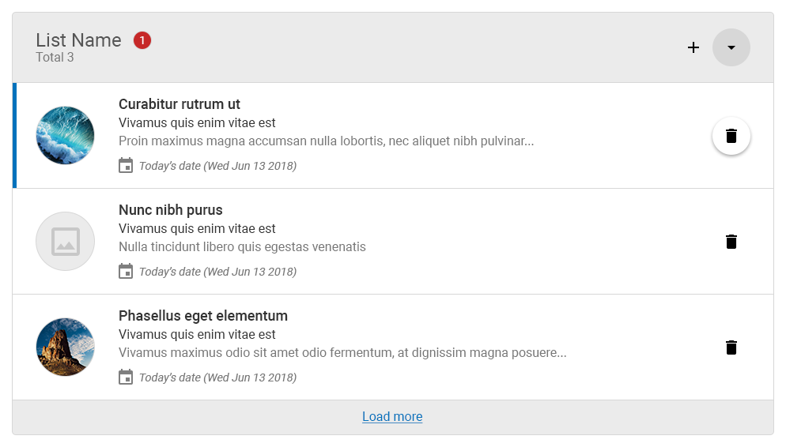
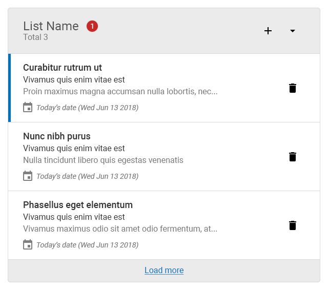

# UI Engineer Coding Scenario

## Getting Started

- Clone the repository.
- Rename your new repository to cority-ui-engineer-test-[first name]-[last name]
- Install packages and run the project ([Node.js](https://nodejs.org/en/) and [Angular CLI](https://github.com/angular/angular-cli) are required).
```shell
npm install
ng serve
```
- To submit your test, please send us the link to your repository.

## Coding Scenario

### Using the mock-ups provided, build a mobile first list component as follows:

Do your best to complete as many steps as you can.

1. Using only HTML, create a template for the structure depicted in the mock-ups.
2. Using CSS, style your template so it matches the mock-ups as closely as possible.
3. Create an Angular list component from your code and import it to the project.
4. Display today's date in the format shown in the mock-ups.
5. Show total number of items in the list header.

### BONUS:

- Add collapse functionality to the list component.
- Configure the component so it loads hardcoded data.
- Make Add and Delete actions functional.


### Component behavior:

- List components can be collapsed by clicking the caret icon. 
- The entire list item can be clicked to open the record.
- The component should be responsive. Hide list icons in small screen.

__Note:__ Do NOT use any CSS frameworks or Angular Libraries.

### Desktop


### Mobile
